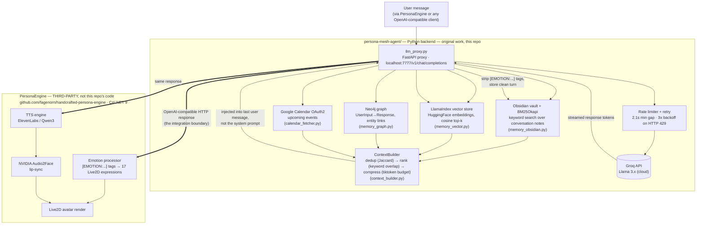

# ARIA — Memory & Retrieval Backend for a Conversational AI Companion

A Python backend that gives a conversational AI persistent, hybrid long-term memory — combining BM25 keyword search, vector embeddings, and a knowledge graph — behind a rate-limited, fault-tolerant proxy in front of the Groq LLM API.

> **Scope note, read first:** This repository is the **Python memory/orchestration backend** (`persona-mesh-agent/`, ~2,900 lines), built entirely by Vrajkumar Patel. It sits in front of, and drives, a **separately developed, third-party avatar/voice engine** — [PersonaEngine](https://github.com/fagenorn/handcrafted-persona-engine) by [@fagenorn](https://github.com/fagenorn) (C#/.NET 9, Live2D + TTS + lip-sync) — which was downloaded, configured, and integrated locally, not authored here. The [Third-Party Integration](#third-party-integration-personaengine) section below draws that line explicitly.

---

## The Problem

Every LLM-backed chat session starts blank. Context windows are finite, and once a conversation ends, everything discussed is gone. For an assistant meant to be used repeatedly over months — as a study companion, a project partner, a persistent agent — that's a hard ceiling: it can never build on what it already knows about the user, and every session pays the "who are you talking to" tax again.

A second, more mundane problem sits underneath the first: real-time conversational LLM APIs (Groq's free tier included) enforce hard requests-per-minute and tokens-per-minute limits. A memory system that queries multiple stores per turn and injects retrieved context into every request makes token usage worse, not better, unless that retrieval is deliberately compressed and rate-limited requests are queued rather than dropped.

## Solution / Architecture

ARIA's backend answers both problems: a hybrid retrieval pipeline that recalls relevant history on every turn, compressed to a strict token budget, sitting behind an LLM proxy that absorbs Groq's rate limits so the conversation never breaks.

The diagram below draws the actual system boundary: everything in the top box is this repository's code. Everything below the line is the third-party avatar engine that consumes this backend's output over HTTP — it is a client of this API, not part of it.



## Technology Stack

**Backend — built by Vrajkumar Patel (`persona-mesh-agent/`):**

| Layer | Technology | Role |
|---|---|---|
| LLM proxy | FastAPI + httpx + uvicorn | OpenAI-compatible `/v1/chat/completions` endpoint, streaming, retry |
| LLM inference | Groq API (Llama 3.x) | Language model, called by the proxy |
| Keyword retrieval | `rank_bm25.BM25Okapi` over an Obsidian markdown vault | Episodic memory — every turn stored as a note |
| Vector retrieval | LlamaIndex + HuggingFace `all-MiniLM-L6-v2` (local) or OpenAI embeddings | Semantic memory |
| Graph retrieval | Neo4j (`neo4j` driver) | Relational memory — entity and turn linkage |
| Context assembly | Custom `ContextBuilder` (Jaccard dedup, keyword ranking, `tiktoken`-budgeted compression) | Merges the three retrieval sources into one injected block |
| NER | spaCy `en_core_web_sm` | Topic/entity extraction for graph nodes and Obsidian topic links |
| Calendar | Google Calendar API, OAuth2 | Injects upcoming events as context |
| Transport | WebSocket server (`memory_websocket_server.py`) | Live graph push to connected clients |

**Third-party — integrated and configured, not authored here:**

| Component | What it is | Source |
|---|---|---|
| PersonaEngine | Avatar orchestration host (C#/.NET 9) | [fagenorn/handcrafted-persona-engine](https://github.com/fagenorn/handcrafted-persona-engine) |
| Live2D avatar rendering, 17 expressions | Character rendering engine | Bundled in PersonaEngine |
| ElevenLabs / Qwen3 | Text-to-speech | Third-party TTS providers, configured via PersonaEngine |
| NVIDIA Audio2Face | Neural lip-sync (audio → blendshapes) | NVIDIA, invoked by PersonaEngine |
| Whisper | Speech-to-text | Bundled in PersonaEngine |

Everything in the second table runs locally, downloaded and configured by the developer — see [Third-Party Integration](#third-party-integration-personaengine) for exactly what was and wasn't written here.

## How the Memory & Retrieval System Works

Three retrieval methods run on every turn, and the reason is that each one is strong exactly where the other two are weak:

- **BM25 over the Obsidian vault** is fast, needs no embedding model or API key, and is precise for exact terms — names, project titles, specific phrases the user actually typed. It's the fallback that always works, since it has no external dependency beyond the `rank_bm25` package.
- **Vector search (LlamaIndex + HuggingFace embeddings)** catches semantic matches BM25 misses — a query about "the housing regression project" can retrieve a note that never uses those exact words. It costs more (an embedding model has to load) and is the layer most likely to be unavailable in a constrained environment, which is why it has a full mock fallback.
- **The Neo4j graph** captures relationships BM25 and vector search can't represent at all — that two turns mention the same entity, or that a topic recurs across sessions — enabling traversal a flat text search can't do.

No single method covers all three cases, so `llm_proxy.py` queries all that are available on every turn (`_build_memory_block`) and hands the combined results to `ContextBuilder`, which:

1. **Deduplicates** near-identical chunks pulled from different sources (Jaccard similarity ≥ 0.70).
2. **Ranks** the survivors by keyword overlap with the current query.
3. **Compresses** to a hard token budget (`MAX_CONTEXT_TOKENS`, default 2000) using `tiktoken`-accurate counting, not a character-length approximation.

Every retrieval layer has an explicit, graceful fallback so the system degrades rather than crashes: Neo4j unavailable → in-process list with keyword scoring; no embedding model available → keyword-overlap mock vector store; `rank_bm25` not installed → raw keyword-count scoring. None of these fallbacks are silent — each logs which mode it's running in, and `/health` reports live vs. mock status.

## LLM Pipeline

`llm_proxy.py` is a drop-in OpenAI-compatible proxy (`/v1/chat/completions`) that PersonaEngine — or any OpenAI-compatible client — points at instead of calling Groq directly. On every request it:

1. Extracts the last user message and injects the current date into the system prompt (added specifically to fix a bug where date questions were answered from stale retrieved memory — see [Engineering Challenges](#engineering-challenges)).
2. Builds and injects the compressed memory block directly into the last user message (not the system prompt, to keep the injection transparent to the calling client).
3. Trims conversation history to the last 4 turns to control token usage.
4. Forwards the request to Groq through a rate limiter (`_groq_throttle`): an `asyncio.Lock`-guarded minimum 2.1-second gap between calls, keeping the proxy under Groq's 30 RPM free-tier ceiling regardless of how fast the client sends requests.
5. On a Groq `429`, retries up to 3 times with linear backoff (3s / 6s / 9s) — in the streaming path this happens without ever surfacing a broken connection to the client; a still-failing stream closes with a clean SSE `[DONE]` rather than hanging.
6. Streams the response back token-by-token, then strips `[EMOTION:...]` tags before persisting the turn to the memory layers — so stored memory is clean text, independent of whatever downstream avatar system is consuming the emotion tags.

## Third-Party Integration: PersonaEngine

[PersonaEngine](https://github.com/fagenorn/handcrafted-persona-engine) is an open-source C#/.NET 9 project by [@fagenorn](https://github.com/fagenorn) that renders a Live2D avatar, drives text-to-speech (ElevenLabs or Qwen3), and runs NVIDIA Audio2Face lip-sync against 17 avatar expressions. **It was not written for this project and is not part of this repository** — it's a general-purpose engine the developer downloaded, ran locally, and pointed at the Python backend above.

What was actually done on this side of the integration:

- Configured `PersonaEngine`'s `TextEndpoint` to point at `llm_proxy.py` instead of Groq directly, so every response is transparently memory-augmented and rate-limited.
- Implemented the `[EMOTION:...]` tag-stripping in `llm_proxy.py` so emotion markup consumed by PersonaEngine's animation system never leaks into stored memory or gets read aloud by TTS.
- GPU/CUDA environment tuning (cuDNN version pin, TTS engine parameter changes) documented in `docs/ARIA-Problems-Log.md`, and a reported patch to `Qwen3SynthesisSession.cs` to bypass CTC alignment gating — these are described in that log as genuine debugging work, but since `PersonaEngine`'s source lives in a separate codebase, they aren't independently verifiable from this repository's own commit history. They're presented here as **integrated and tuned**, not built.

No avatar rendering, TTS, or lip-sync code in this project was written by the developer. Full credit for that engine belongs to @fagenorn.

## Engineering Challenges

Pulled from `docs/ARIA-Problems-Log.md`, a running debugging log kept during development. The first three are fixes made in this repository's own code; the last two are environment/configuration tuning on the third-party engine.

**Groq 429 rate limiting under live conversation** — The free tier's 30 RPM / TPM limits were being hit during real usage, producing silent failures downstream. Fixed in `llm_proxy.py` with a combination of changes: shorter trimmed history (6 turns → 4), a hard 700-character cap on injected memory, a 3-attempt retry with linear backoff on `429`, proper non-200 handling in the streaming path so a failure returns a clean `[DONE]` instead of hanging the connection, and the `_groq_throttle` minimum-gap limiter.

**HTML leaking into memory context** — Obsidian notes created by web-clipper plugins contained raw HTML markup (`<button type="button" aria-haspopup...`), which was being retrieved and injected verbatim into LLM context. Fixed with an `_HTML_TAG` regex strip applied to every memory block before injection.

**Wrong context injected on date questions** — Asking "what date is it today?" triggered a semantic match on an unrelated note that happened to contain the word "today," and the proxy never injected the actual date anywhere. Fixed by injecting `datetime.now()` into the system prompt on every request.

**CUDA/cuDNN conflicts across the local GPU inference stack** *(third-party environment, tuned not built)* — Running Whisper, TTS, and Audio2Face simultaneously caused 20–30 second ONNX initialization stalls, traced to a cuDNN 9.6 regression in Audio2Face's session init. Resolved by pinning cuDNN to 9.1.1 and moving LLM inference off-device to Groq entirely, removing GPU contention.

**TTS stutter** *(third-party engine, tuned not built)* — The local TTS engine produced audio stutter, traced to `Temperature: 1` (too high) and no repetition penalty. Resolved by tuning `Temperature → 0.6`, `RepetitionPenalty → 1.05`, and adjusting chunk-emission frame count. Per the debugging log, a deeper fix involved bypassing CTC-alignment gating in the engine's synthesis session — plausible given the symptoms described, but not verifiable independently since that file lives in the third-party codebase, not this repository.

## Limitations

- No automated tests and no CI/CD exist for this repository's own code.
- The BM25 and vector fallback modes (used when `rank_bm25`/embedding dependencies or credentials are missing) are simple keyword-overlap heuristics, not a substitute for real retrieval quality — they exist to keep the system running, not to match production-grade recall.
- The rate limiter is a fixed 2.1-second minimum gap, not an adaptive limiter that reads Groq's actual rate-limit response headers.
- No retrieval-quality evaluation harness exists — there are no precision/recall numbers on a labeled query set, and this README makes no performance claims that aren't independently checkable.
- Single-user by design: one Obsidian vault path, one Neo4j database, no multi-tenant isolation.
- The full experience (avatar, voice, lip-sync) requires Windows and a CUDA-capable GPU for the third-party engine; the Python backend itself is platform-independent.

## Future Work

- Add a test suite and CI pipeline for the Python backend.
- Replace the fixed-gap throttle with an adaptive limiter driven by Groq's rate-limit response headers.
- Build a small labeled query set to measure retrieval precision/recall across the BM25/vector/graph hybrid, rather than relying on qualitative testing.
- Containerize the backend (Dockerfile + docker-compose alongside the existing Neo4j container instructions) for easier setup.
- Multi-user support: per-user vault/index/graph isolation and auth on the proxy endpoints.

## Freelance Relevance

This project is the clearest demonstration in the portfolio of building the infrastructure layer AI agent and RAG work actually depends on, not just calling an LLM API and shipping a demo. Specifically, it shows:

- **Retrieval system design** — combining lexical (BM25), semantic (vector), and relational (graph) retrieval deliberately, with a defensible reason for each, rather than defaulting to "just add a vector database."
- **LLM API reliability engineering** — rate limiting, retry/backoff, and streaming error handling built to survive a provider's free-tier limits under real, bursty usage rather than clean demo conditions.
- **Graceful degradation as a design pattern** — every external dependency (embedding model, graph database, LLM) has an explicit fallback path so the system stays usable, not just correct when everything is configured.

These are the same problems that come up in client RAG/agent work: unreliable third-party APIs, retrieval quality trade-offs, and systems that need to keep working when a dependency isn't available in a given environment.

---

## Quick Start

### Prerequisites
- Python 3.11+
- Groq API key (free tier works)
- Optional: Neo4j (local Docker or Aura free tier), for graph memory
- Optional, Windows + CUDA GPU only: [PersonaEngine 3.0.2](https://github.com/fagenorn/handcrafted-persona-engine) for the avatar/voice layer

### 1. Clone and install

```bash
git clone https://github.com/vrajkumarpatel/ARIA.git
cd ARIA/persona-mesh-agent
pip install -r requirements.txt
python -m spacy download en_core_web_sm
```

### 2. Configure

```bash
cp .env.example .env
# Edit .env:
#   OPENAI_API_KEY=your_groq_key
#   OPENAI_BASE_URL=https://api.groq.com/openai/v1
#   LLM_MODEL=llama-3.3-70b-versatile
```

### 3. Run the memory proxy

```bash
python llm_proxy.py
# Listening on http://localhost:7777/v1
```

The proxy works standalone with no PersonaEngine required — point any OpenAI-compatible client at `http://localhost:7777/v1`, or use the included CLI (`python agent.py`), which falls back to mock LLM and in-memory stores with zero API keys configured.

### 4. (Optional) Neo4j graph memory

```bash
docker run -p 7474:7474 -p 7687:7687 -e NEO4J_AUTH=neo4j/password neo4j:latest
```

### 5. (Optional) Connect PersonaEngine for the avatar/voice layer

Copy `config/appsettings.example.json` to your PersonaEngine directory as `appsettings.json`, set `TextEndpoint` to `http://localhost:7777/v1`, and fill in your own TTS API keys. `start_aria.bat` launches both processes together.

### 6. (Optional) Import prior AI conversation history

```bash
# Place ChatGPT export .md files in a CHATGPT/ directory
python import_chatgpt_md.py
```

### 7. (Optional) Google Calendar

```bash
python -c "from agent_core.calendar_fetcher import authenticate; authenticate()"
```

## Project Structure

```
ARIA/
├── persona-mesh-agent/              # Python backend — all original code (~2,900 lines)
│   ├── llm_proxy.py                 # LLM memory proxy — main entry point
│   ├── api_server.py                # REST API bridge (no WebSocket)
│   ├── memory_websocket_server.py   # REST + WebSocket combined server
│   ├── agent.py                     # CLI chat interface (dev/testing)
│   ├── import_chatgpt_md.py         # ChatGPT conversation importer
│   ├── clean_vault.py               # Vault cleanup utility
│   ├── requirements.txt
│   ├── .env.example
│   └── agent_core/
│       ├── config.py                # Env-var configuration
│       ├── llm_interface.py         # OpenAI-compatible LLM client
│       ├── persona.py               # Stateless persona/prompt engine
│       ├── context_builder.py       # Dedup → rank → compress pipeline
│       ├── memory_vector.py         # LlamaIndex vector store
│       ├── memory_graph.py          # Neo4j graph memory
│       ├── memory_obsidian.py       # Obsidian vault store + BM25 search
│       ├── entity_extractor.py      # spaCy NER
│       └── calendar_fetcher.py      # Google Calendar OAuth2 integration
├── config/
│   └── appsettings.example.json     # PersonaEngine config template (keys redacted)
├── docs/
│   └── ARIA-Problems-Log.md         # Debugging log kept during development
├── start_aria.bat                   # Launches proxy + PersonaEngine together
└── .gitignore                       # Excludes PersonaEngine binaries, vault data, secrets
```

`handcrafted-persona-engine-main/`, `PersonaEngine-3.0.2-win-x64/`, and `llama-build/` are present on disk locally (a build dependency and the third-party engine's release) but are excluded via `.gitignore` — they are not part of this repository's tracked history.

## API Reference

### Memory Proxy (`llm_proxy.py` — port 7777)

| Method | Endpoint | Description |
|---|---|---|
| `POST` | `/v1/chat/completions` | OpenAI-compatible endpoint — memory-injected, rate-limited, streaming |
| `GET` | `/v1/models` | Static model list (served locally, avoids a TLS round-trip to Groq on startup) |
| `GET` | `/health` | Liveness check + memory stats (live vs. mock mode for each layer) |

### Memory Server (`memory_websocket_server.py` — port 8765/8766)

| Method | Endpoint | Description |
|---|---|---|
| `POST` | `/api/context` | Query memory for a user input — returns retrieval context |
| `POST` | `/api/store` | Persist a conversation turn to all memory layers |
| `POST` | `/api/index-files` | Index a file or directory into vector memory |
| `GET` | `/api/graph` | Pull current Neo4j graph snapshot |
| `GET` | `/api/stats` | Memory statistics |
| `GET` | `/health` | Liveness + component status |
| `WS` | `ws://localhost:8766` | Live graph push on every memory store |

```json
POST /api/context
{
  "user_input": "what did I say about backpropagation?",
  "top_k": 3
}

→ {
  "combined_context": "...",
  "summary": "3 chunk(s) retrieved — query: what did I say...",
  "sources": ["LlamaIndex", "Neo4j"],
  "semantic_memory": "...",
  "graph_memory": "..."
}
```

## Environment Variables

| Variable | Default | Description |
|---|---|---|
| `OPENAI_API_KEY` | — | API key (Groq or any OpenAI-compatible provider) |
| `OPENAI_BASE_URL` | `https://api.openai.com/v1` | Endpoint — set to Groq for free inference |
| `LLM_MODEL` | `gpt-4o-mini` | Model name |
| `EMBEDDING_MODEL` | `text-embedding-3-small` | Embedding model (used only with OpenAI embeddings) |
| `OBSIDIAN_VAULT_PATH` | `C:\ARIA\ARIA-Memory-Vault` | Path to the Obsidian vault |
| `NEO4J_URI` | `bolt://localhost:7687` | Neo4j connection URI |
| `NEO4J_USER` | `neo4j` | Neo4j username |
| `NEO4J_PASSWORD` | `password` | Neo4j password |
| `TOP_K_VECTOR` | `3` | Number of vector results retrieved per query |
| `MAX_CONTEXT_TOKENS` | `2000` | Hard token budget for injected context |
| `DATA_DIR` | `./data` | Directory for documents to index |
| `WATCH_DIRS` | — | Comma-separated directories for auto-indexing |

## Capstone Context

ARIA (Adaptive Responsive Intelligent Agent) was built and presented as a senior AI capstone at National Louis University (NLU AI Senior Capstone Showcase, May 2026), where it was awarded 1st place by the faculty panel. The capstone framing was a full conversational companion — memory backend plus the integrated third-party avatar/voice layer described above; this README documents the backend the developer actually built, separately from the engine it drives.

## Author

**Vrajkumar Patel**
BS Computer Science & Information Systems, AI Concentration
National Louis University — Graduating Summer 2026
F-1 Student | Open to AI/ML Engineering roles

[GitHub](https://github.com/vrajkumarpatel) · [Email](mailto:vp431030@gmail.com)

## License

MIT — see [LICENSE](LICENSE).

PersonaEngine (the avatar/voice engine referenced throughout this README) is a separate open-source project by [@fagenorn](https://github.com/fagenorn/handcrafted-persona-engine), licensed and maintained independently. This repository's MIT license covers only the code in `persona-mesh-agent/` and the rest of this tracked repository — it does not extend to PersonaEngine.
